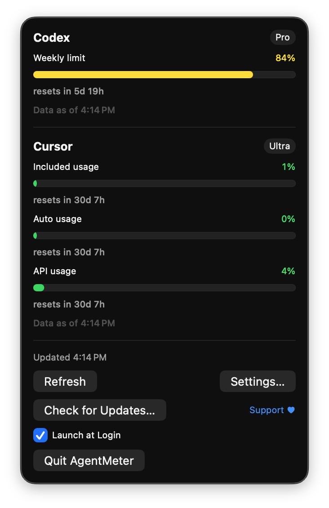
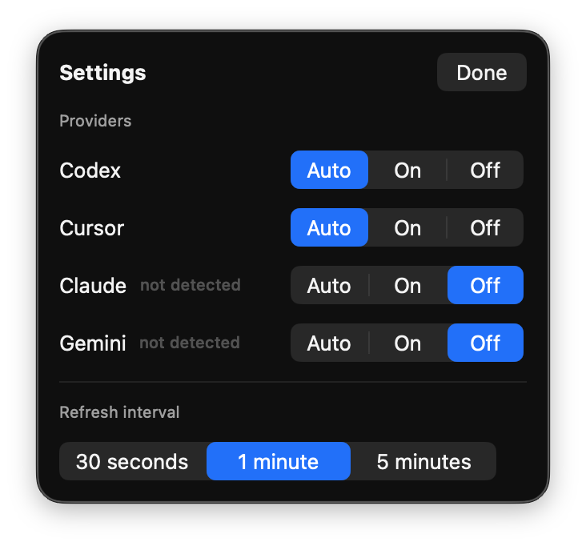

# AgentMeter

A tiny macOS menu bar app (no Dock icon) that keeps your AI coding usage limits
visible at a glance — Codex/ChatGPT, Cursor, Claude Code, and Gemini — with a
dropdown showing detailed meters and reset countdowns.

The menu bar shows the most constrained window per enabled provider, e.g.:

```
Cx 5% · Cu 20% · Cl 40% · Ge 12%
```

<p align="center">
  
  
</p>

## Providers

| Provider | Source | How usage is read |
|----------|--------|-------------------|
| **Codex** (`Cx`) | Local Codex CLI session logs (`~/.codex/sessions/`) | Parses the newest `rate_limits` snapshot; 5h + weekly windows. No network. |
| **Cursor** (`Cu`) | `cursor.com/api/usage-summary` | Uses the session token Cursor stores locally; included/auto/API usage + billing reset. Team/enterprise pools supported. |
| **Claude** (`Cl`) | `api.anthropic.com/api/oauth/usage` | Uses the Claude Code OAuth token (credentials file or Keychain); 5h + weekly (+Opus) windows. |
| **Gemini** (`Ge`) | Cloud Code quota API | Uses the Gemini CLI OAuth token (`~/.gemini/oauth_creds.json`); Pro/Flash/Flash-Lite daily quotas. |
| **OpenRouter** (`OR`) | `openrouter.ai/api/v1/credits` | Connect via OAuth (provisions a dedicated, revocable key) or paste a key; shows credits remaining. |
| **DeepSeek** (`DS`) | `api.deepseek.com/user/balance` | Paste an API key; shows prepaid balance. |
| **Kimi** (`Ki`) | `api.moonshot.ai/v1/users/me/balance` | Paste an API key; shows available balance. |
| **Z.ai** (`Zg`) | `api.z.ai` quota API | Paste an API key; shows coding-plan time/token quota percentages. |
| **Venice** (`Ve`) | `api.venice.ai/api/v1/billing/balance` | Paste an API key; shows USD/DIEM balance. |

Subscription-style providers show percent-of-limit meters; pay-as-you-go
(API-key) providers show the balance that remains, since there is no limit
percentage to measure.

Each provider can be set to **Auto** (show only if detected on this machine),
**On**, or **Off** in Settings. Refresh runs every 30s/1m/5m (configurable), and
Codex also refreshes instantly after CLI activity via a file watcher.

## Privacy and trust

AgentMeter is open source (MIT) so you can verify exactly what it does:

- For Codex, Cursor, Claude, and Gemini, credentials are **read fresh on each
  refresh** from the locations the official CLIs/apps already use. They are
  **never written anywhere** by AgentMeter and never leave your machine except
  as the `Authorization`/`Cookie` header on the request to that provider's own
  API.
- For API-key providers (OpenRouter, DeepSeek, Kimi, Z.ai, Venice), the key you
  provide is stored **only in your macOS Keychain** as an item private to
  AgentMeter, shown masked in Settings, removable with one click, and sent
  only to that provider's own API. We recommend creating a dedicated key named
  "AgentMeter" so you can revoke it independently. OpenRouter can instead be
  connected via OAuth, which provisions its own revocable key without you
  handling one at all.
- Codex data is parsed entirely locally and makes **no network calls**.
- No analytics, no telemetry, no accounts.

## Requirements

- macOS 14 (Sonoma) or later
- The CLIs/apps you want to monitor, signed in (Codex CLI, Cursor, Claude Code, Gemini CLI)

## Install

Download the latest `AgentMeter.zip` from
[Releases](https://github.com/fdtorres1/AgentMeter/releases/latest), unzip,
and drag `AgentMeter.app` to `/Applications`. Signed and notarized builds open
without Gatekeeper warnings.

### Build from source

```bash
swift build              # debug build
swift test               # unit tests (live-network tests are opt-in)
scripts/bundle.sh         # builds AgentMeter.app in the repo root
scripts/bundle.sh --install   # also copies it to /Applications
open AgentMeter.app
```

Use the "Launch at Login" checkbox in the dropdown to start it automatically.

## Project layout

- `Sources/AgentMeter/Providers/` — one file per provider plus the `UsageProvider`
  protocol; each reads local credentials and maps the response to `UsageWindow`s.
- `Sources/AgentMeter/UsageStore.swift` — refresh timer, Codex file watcher, menu bar title.
- `Sources/AgentMeter/SettingsStore.swift` — per-provider visibility + refresh cadence.
- `Sources/AgentMeter/MenuContent.swift` — dropdown and settings UI.
- `Sources/AgentMeter/UpdateChecker.swift` — GitHub Releases update check.
- `scripts/bundle.sh` / `scripts/release.sh` — bundling and signed/notarized release.
- `.github/workflows/` — CI tests and tagged release automation.

## Support

If AgentMeter saves you from a surprise rate limit, you can
[buy me a coffee](https://www.buymeacoffee.com/fdtorres). Entirely optional.

## Credits

Endpoint formats were validated against the excellent open-source
[CodexBar](https://github.com/steipete/CodexBar) by Peter Steinberger.

## License

MIT — see [LICENSE](LICENSE).
