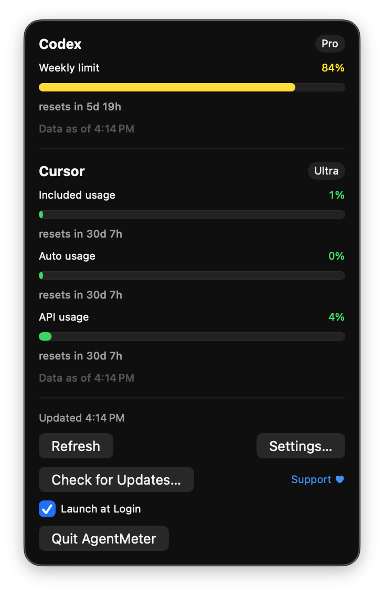
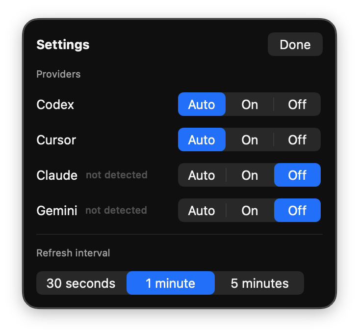
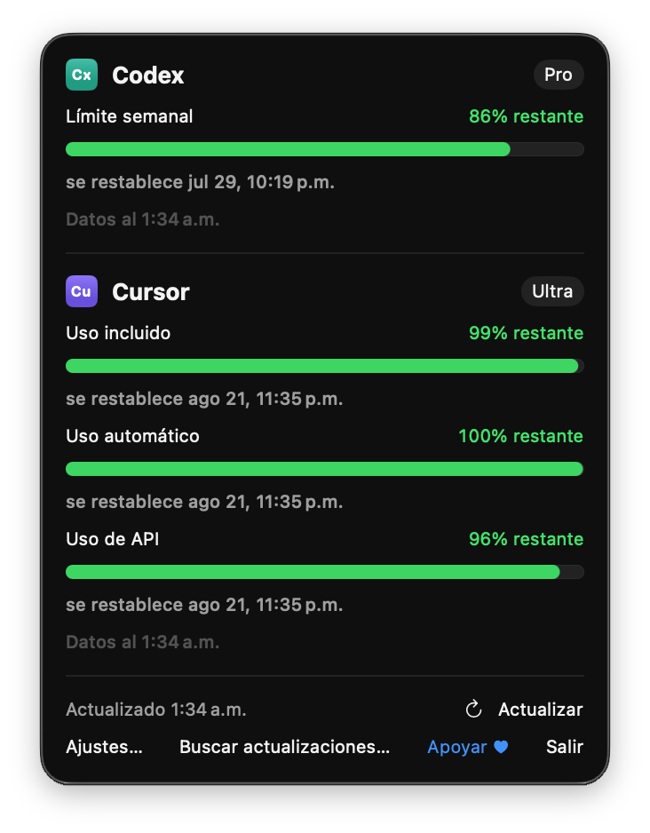

# AgentMeter

A tiny macOS menu bar app (no Dock icon) that keeps your AI coding usage limits
visible at a glance — Codex/ChatGPT (one or several accounts), Cursor, Claude
Code, and Gemini, Claude API spending and token usage, plus pay-as-you-go balances for OpenRouter, DeepSeek, Kimi,
Z.ai, and Venice — with a dropdown showing detailed meters, reset countdowns,
and balances. Your coding agents can read the same numbers through a small
read-only CLI.

The menu bar shows the most constrained window per enabled provider, e.g.:

```
Cx 5% · CxW 62% · Cu 20% · Cl 40% · OR $8.06
```

<p align="center">
  
  
</p>

## Providers

| Provider | Source | How usage is read |
|----------|--------|-------------------|
| **Codex** (`Cx`, `CxW`, …) | Your own Codex CLI via its app-server protocol; session logs as offline fallback | Live limits, plan, and signed-in email, polled every 5 minutes through a ~1-second `codex app-server` call. **Multiple accounts**: sign in extra Codex homes and each gets its own meter. Optional subscription renewal-date tracking with reminders. See [docs/CODEX_ACCOUNTS.md](docs/CODEX_ACCOUNTS.md). |
| **Cursor** (`Cu`) | `cursor.com/api/usage-summary` | Uses the session token Cursor stores locally; included/auto/API usage + billing reset. Team/enterprise pools supported. |
| **Claude** (`Cl`) | `api.anthropic.com/api/oauth/usage` | Uses the Claude Code OAuth token (credentials file or Keychain); 5h + weekly (+Opus) windows. |
| **Claude API** (`ClA`) | Anthropic organization Usage & Cost API | Paste an organization reporting key; shows current UTC calendar-month spending and input/output/cache tokens. Prepaid credits are unavailable via the public API; a link opens Console billing. |
| **Gemini** (`Ge`) | Cloud Code quota API | Uses the Gemini CLI OAuth token (`~/.gemini/oauth_creds.json`); Pro/Flash/Flash-Lite daily quotas. |
| **OpenRouter** (`OR`) | `openrouter.ai/api/v1/credits` + `/api/v1/key` | Connect via OAuth (provisions a dedicated, revocable key) or paste a key; shows account credits when permitted, otherwise the key's limit/remaining balance or current-month spend. |
| **DeepSeek** (`DS`) | `api.deepseek.com/user/balance` | Paste an API key; shows prepaid balance. |
| **Kimi** (`Ki`) | `api.moonshot.ai/v1/users/me/balance` | Paste an API key; shows available balance. |
| **Z.ai** (`Zg`) | `api.z.ai` quota API | GLM Coding Plan only: paste the plan's API key to show time/token quota percentages. Z.ai does not expose standard pay-as-you-go balance via a public API. |
| **Venice** (`Ve`) | Venice billing / key rate-limit APIs | Paste an Inference or Admin API key; shows USD/DIEM balance. Admin keys use the richer billing endpoint, while safer Inference keys use the rate-limits balance fallback. x402 wallet balances are not supported. |

Subscription-style providers show percent-of-limit meters; pay-as-you-go
(API-key) providers show reported balance or spending, since there is no limit
percentage to measure.

### Claude API setup

In **Settings → Providers → Claude API**, save an organization Admin API key
or an eligible personal/service-account key that is not scoped to a workspace.
AgentMeter stores the key in its own macOS Keychain item and only sends read-only
report requests to Anthropic. Ordinary workspace keys and individual accounts
cannot use the reporting API. These reports cover the organization, not just
requests made with the saved key. Claude Code subscription limits remain in the
separate **Claude** entry.

Spending covers the current calendar month in UTC, excludes Priority Tier
costs, and may lag the Anthropic website. AgentMeter shows the returned report
cutoff and flags when today's totals are not yet fully reported. "Last checked"
means when AgentMeter fetched the report, not how current Anthropic's data is.
Reports are cached for five
minutes during automatic polling. The Refresh button and `agentmeter refresh`
bypass that cache; after an API failure, retries wait one minute. Input tokens
exclude cache reads and cache creation, which have their
own rows. **Prepaid credits are not inferred from spending**: use the billing
link to see the actual credit balance. See Anthropic's
[Usage & Cost API](https://platform.claude.com/docs/en/manage-claude/usage-cost-api)
and [API billing guide](https://support.claude.com/en/articles/8977456-how-do-i-pay-for-my-claude-api-usage).

Each provider can be set to **Auto** (show only if detected on this machine),
**On**, or **Off** in Settings, and shown or hidden in the menu bar
independently. Refresh runs every 30s/1m/5m (configurable); Codex also
refreshes instantly after CLI activity via a file watcher, and the app
refreshes on wake.

## Highlights

- **Reads well before it runs out** — count usage up ("80% used") or down
  ("20% left"), relative or exact reset times (with a remaining duration), and optional notifications when
  a limit window or balance crosses your threshold.
- **Never cries wolf** — if a provider briefly fails to respond, the last
  known numbers stay visible (dimmed, with a "stale since…" note) instead of
  an alarming error in your menu bar.
- **Knows what key you pasted** — AgentMeter detects the key type (for
  example Venice Admin vs. Inference, OpenRouter management vs. standard) and
  explains in plain language what it can do, always recommending the
  least-privileged key that works.
- **Fits your menu bar** — full, compact (most constrained provider only), or
  icon-only styles, with color states at the same thresholds as the meters.
- **Accessible** — full VoiceOver support: the menu bar item speaks a
  per-provider summary, meters announce values and severity, and warning
  states show symbols, not just color.
- **Several Codex accounts at once** — personal, work, and legacy
  subscriptions each get their own meter, label, and menu bar code, with
  optional billing-renewal reminders kept strictly separate from usage
  windows. See [docs/CODEX_ACCOUNTS.md](docs/CODEX_ACCOUNTS.md).
- **Stays current** — Sparkle auto-updates from signed, notarized releases.
- **Your agents can read it too** — an opt-in, read-only JSON snapshot, an
  `agentmeter` CLI, and a drop-in agent skill let scripts and coding agents
  check remaining quota before starting a big task. See
  [docs/AGENT_INTERFACE.md](docs/AGENT_INTERFACE.md).
- **Bilingual** — English and Spanish, following your macOS language.

## Privacy and trust

AgentMeter is open source (MIT) so you can verify exactly what it does:

- For Cursor, Claude, and Gemini, credentials are **read fresh on each
  refresh** from the locations the official CLIs/apps already use. They are
  **never written anywhere** by AgentMeter and never leave your machine except
  as the `Authorization`/`Cookie` header on the request to that provider's own
  API.
- For API-key providers (OpenRouter, DeepSeek, Kimi, Z.ai, Venice), the key you
  provide is stored **only in your macOS Keychain** as an item private to
  AgentMeter, shown masked in Settings, removable with one click, and sent
  only to that provider's own API. We recommend creating a dedicated key named
  "AgentMeter" so you can revoke it independently. OpenRouter can instead be
  connected via OAuth, which provisions its own revocable key without you
  handling one at all.
- For Codex, AgentMeter never touches tokens at all: it launches your own
  `codex` CLI for about a second and asks it over its documented JSON-RPC
  protocol; Codex handles auth and talks to OpenAI itself. Session-log
  parsing remains as a fully offline fallback. AgentMeter never performs
  logins — you sign in extra accounts with `codex login` yourself.
- Nothing runs in the background besides the menu bar app itself: the Codex
  helper exits after each ~1-second query, and the `agentmeter` CLI is a
  read-only client that never sees credentials.
- No analytics, no telemetry, no accounts.

## Requirements

- macOS 14 (Sonoma) or later
- The CLIs/apps you want to monitor, signed in (Codex CLI, Cursor, Claude Code, Gemini CLI)
- For live Codex data: the Codex CLI on your PATH or in `/opt/homebrew/bin`,
  `/usr/local/bin`, or `~/.local/bin` (session logs are used otherwise)

## Install

```bash
brew install --cask fdtorres1/tap/agentmeter
```

Or download the latest `AgentMeter.zip` from
[Releases](https://github.com/fdtorres1/AgentMeter/releases/latest), unzip,
and drag `AgentMeter.app` to `/Applications`. Signed and notarized builds open
without Gatekeeper warnings, and the app keeps itself up to date (Sparkle).

### Build from source

```bash
swift build              # debug build
swift test               # unit tests (live-network tests are opt-in)
scripts/bundle.sh         # builds AgentMeter.app in the repo root
scripts/bundle.sh --install   # also copies it to /Applications
open AgentMeter.app
```

Use the "Launch at Login" toggle in Settings → General to start it automatically.

## Multiple Codex accounts

Sign in another account into its own Codex home, then add it in Settings —
AgentMeter discovers signed-in `~/.codex-*` folders automatically:

```bash
mkdir -p ~/.codex-work && CODEX_HOME=~/.codex-work codex login
```

Each account becomes its own provider (`Codex — work`, menu bar `CxW`) with
independent visibility and alerts. AgentMeter never performs the login or
reads the resulting tokens; it only asks your Codex CLI for the numbers.
You can also record each subscription's renewal date and billing platform and
get a reminder a few days before. Full guide:
[docs/CODEX_ACCOUNTS.md](docs/CODEX_ACCOUNTS.md).

## Agent & CLI access

Turn on **Settings → General → Enable agent & CLI access** and AgentMeter
writes a machine-readable snapshot (usage numbers only — never credentials) to
`~/Library/Application Support/AgentMeter/status.json` after each refresh. The
bundled CLI reads it:

```bash
agentmeter status          # human-readable table
agentmeter status --json   # stable, versioned JSON for scripts/agents
agentmeter refresh --wait 15
agentmeter doctor          # redacted troubleshooting report
agentmeter skill           # prints the agent skill (see below)
```

Every provider — including each Codex account — appears as its own entry with
usage windows, balance, freshness, plan, account email, and any tracked
renewal date.

Homebrew puts `agentmeter` on your PATH; otherwise use **Settings → General →
Install Command-Line Tool…**. The app remains the only process that touches
credentials or provider APIs — the CLI is a thin, read-only client.

To teach your coding agent to check its own budget before big tasks, install
the bundled skill (Codex, Claude Code, and Cursor all read this format):

```bash
mkdir -p ~/.codex/skills/agentmeter && agentmeter skill > ~/.codex/skills/agentmeter/SKILL.md
```

Full schema, skill, and security model in
[docs/AGENT_INTERFACE.md](docs/AGENT_INTERFACE.md).

## Project layout

- `Sources/AgentMeter/Providers/` — one file per provider plus the `UsageProvider`
  protocol; each reads local credentials and maps the response to `UsageWindow`s.
  `CodexAppServerClient.swift` talks to the Codex CLI; `CodexAccountConfig.swift`
  holds extra-account config and discovery.
- `Sources/AgentMeter/UsageStore.swift` — dynamic provider list, refresh timer, Codex file watcher, menu bar title and spoken summary.
- `Sources/AgentMeter/SettingsStore.swift` — visibility, refresh cadence, display/alert preferences, Codex accounts, renewal dates.
- `Sources/AgentMeter/MenuContent.swift` + `ProviderUsageSections.swift` — dropdown UI (shared with the Usage Details window); `SettingsWindow.swift` — native tabbed Settings.
- `Sources/AgentMeter/CredentialAssessment.swift` — key-type detection and plain-language explainers.
- `Sources/AgentMeter/SubscriptionRenewal.swift` — renewal-date model and reminder math.
- `Sources/AgentMeter/StatusSnapshotWriter.swift` — opt-in `status.json`; `Sources/AgentMeterStatusKit/` — shared snapshot schema, CLI parsing, embedded agent skill; `Sources/agentmeter-cli/` — the read-only CLI.
- `Sources/AgentMeter/Updater.swift` — Sparkle auto-updates.
- `docs/` — [agent interface](docs/AGENT_INTERFACE.md), [Codex accounts guide](docs/CODEX_ACCOUNTS.md), [agent skill](docs/agent-skill/SKILL.md), [releasing](docs/RELEASING.md).
- `scripts/bundle.sh` / `scripts/release.sh` — bundling and signed/notarized release.
- `.github/workflows/` — CI (build + tests); releases are built and notarized locally.

## En español

AgentMeter habla español — la interfaz sigue el idioma de macOS. Translations
for other languages are welcome: all strings live in a single
[String Catalog](Sources/AgentMeter/Resources/Localizable.xcstrings), so adding
a language is a JSON-only pull request.

<p align="center">
  
</p>

## Support

If AgentMeter saves you from a surprise rate limit, you can
[buy me a coffee](https://www.buymeacoffee.com/fdtorres). Entirely optional.

## Credits

Endpoint formats were validated against the excellent open-source
[CodexBar](https://github.com/steipete/CodexBar) by Peter Steinberger.

## License

MIT — see [LICENSE](LICENSE).
